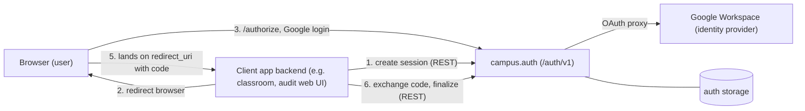
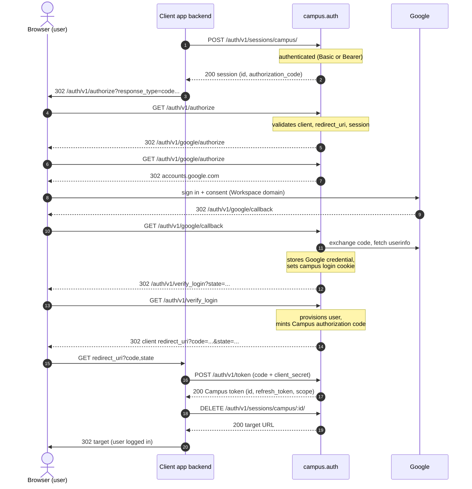
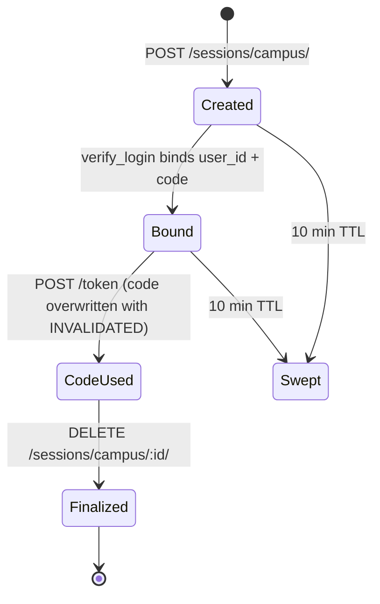

# Browser Login Flow (campus.auth)

Canonical reference for the end-to-end browser login flow against
`campus.auth`: how a client application initiates a session, how the
user logs in via Google Workspace, and how the authorization code is
exchanged for a Campus token.

Audience: implementers writing client apps (campus-classroom, audit web
UI, CLIs) and agents working on the auth service. For service
boundaries see [architecture.md](architecture.md); for endpoint-level
request/response schemas see `campus/auth/docs/openapi.yaml`.

**Diagram convention:** the fenced ` ```mermaid ` blocks below are the
source of truth for the diagrams. GitHub renders them automatically;
agents and other tools should parse the block text directly (it is
plain, structured ASCII) instead of scraping rendered output.

Verified against `weekly` at `f5ae142` (2026-10-01). If this document
disagrees with the code, the code wins — please fix the doc.

## Who does what

Four actors participate:

- **Browser (user)** — the human's browser; only ever redirected,
  never holds a Campus token.
- **Client app backend** — the OAuth client (e.g. campus-classroom,
  the audit web UI). Registers a `redirect_uri`, creates the auth
  session, exchanges the code.
- **campus.auth** — the OAuth 2.0 *authorization server* (issues
  Campus tokens) and simultaneously an OAuth *proxy* to Google for
  identity.
- **Google Workspace** — the upstream identity provider. Login is
  federated: campus.auth never sees a password and restricts
  principals to `WORKSPACE_DOMAIN`.



All `campus.auth` routes live under the `/auth/v1` prefix
(`campus/auth/__init__.py` registers the `auth` blueprint with
`url_prefix="/auth/v1"`). Paths below are written relative to the
service origin.

## End-to-end sequence



## Step by step

### 1. Client creates an auth session (server-to-server)

`POST /auth/v1/sessions/campus/` — authenticated with the client's own
credentials (HTTP Basic `client_id:client_secret`, or a Bearer Campus
token). Body: `client_id`, `redirect_uri` (must be registered on the
client), optional `scopes`, optional `target` (final destination after
login), optional `user_id`.

Requested `scopes` are validated **fail-closed** against the client's
registered `allowed_scopes` allowlist: a scope the client is not
registered for rejects the request with 400 `invalid_scope`, and a
client with an empty allowlist cannot request any scope (see
*Scope algebra* below). The service then creates an `AuthSession`
record (`campus/auth/resources/session.py`): a generated session `id`,
a pre-generated `authorization_code`, `state` (defaults to the session
id), and the `redirect_uri`/`target` pair. Default lifetime is 10
minutes (`DEFAULT_OAUTH_EXPIRY_MINUTES`). Response body is the session
resource, including `id` and `authorization_code`.

### 2. Client sends the browser to `/authorize`

`GET /auth/v1/authorize?client_id=...&response_type=code&redirect_uri=...&state=<session id>`
(`campus/auth/provider.py::authorize`, RFC 6749 §4.1.1). The client
backend issues the 302; the browser never calls the sessions API.

`/authorize` validates, in order:

- `response_type` must be `code` (the only supported grant here);
- the client exists, and **fail-closed** `redirect_uri` validation:
  the request's `redirect_uri` must exactly match one of the client's
  registered `redirect_uris` — a client with no registered URIs is
  rejected outright, and a mismatch is rejected with 400 *without*
  redirecting (RFC 6749 §3.1.2.2/§4.1.2.1, issues #651/#685);
- the session exists (`state` is the session id) and its `client_id`
  and `redirect_uri` match the request;
- if the request carries a `scope` parameter, it must be within the
  session's scopes — exceeding it is rejected with 400 `invalid_scope`
  (the session API is the validated boundary);
- if the request carries an `upstream_scope` parameter (space-delimited
  Google scopes), each must be in the client's registered
  `upstream_scopes["google"]` allowlist — fail-closed, 400
  `invalid_scope` otherwise. **Deprecated (#733):** client allowlists
  are identity-only, so any integration ask (e.g. Classroom scopes)
  fails closed; the parameter is warned on and audited
  (`campus.auth.deprecated_call`) ahead of removal, and is reserved
  for hypothetical identity-client growth. Integrations connect via
  the per-integration connect flow instead (see *Integration connect
  flows*).

Scope **consent** (a user-facing screen) is not implemented yet: the
validated session scopes are granted. On success the browser is
redirected to `/auth/v1/google/authorize` with `target` pointing at
`/auth/v1/verify_login?state=<session id>` (plus `scope` when upstream
scopes were requested).

### 3. Google leg (OAuth proxy)

`GET /auth/v1/google/authorize` (`campus/auth/oauth_proxy/google/`)
builds the Google authorization URL (default `hd=nyjc.edu.sg`) and
redirects the browser to Google. Its `scope` parameter names upstream
Google scopes beyond the proxy's base `email profile`; requested
scopes are merged with the base set and sent with
`include_granted_scopes=true`, so Google's consent screen shows the
new scopes and the grant **accumulates** — on re-consent Google
returns the cumulative scope set, and the stored Google credential
grows to the union (Campus's hosted incremental authorization; what
an app may request is capped by its `upstream_scopes` allowlist).
The proxy keeps its *own* auth
session (separate from the Campus session in step 1) and stores its id
in the Flask session cookie as CSRF `state`.

The user signs in and consents at Google. Google redirects the browser
to `GET /auth/v1/google/callback?state=...&code=...&scope=...`. The
proxy (`google/proxy.py::handle_consent_callback`):

1. validates `state` and exchanges the code with Google's token
   endpoint;
2. verifies the granted scopes and fetches userinfo;
3. rejects emails whose domain != `WORKSPACE_DOMAIN`;
4. upserts the user's *Google* credential (Campus stores the Google
   access/refresh token for later Google API calls);
5. sets the Campus login cookie: `flask.session["user_id"] = <email>`;
6. redirects to the saved `target` — for the login flow, that is
   `verify_login` with `state` preserved.

### 4. `verify_login` issues the Campus authorization code

`GET /auth/v1/verify_login?state=<session id>`
(`provider.py::verify_login_and_redirect`) re-checks the domain,
reuses or refreshes the stored Google credential to fetch userinfo,
auto-provisions the Campus user record (`users.get_or_create`), then
generates a *fresh* authorization code and binds it (and `user_id`)
onto the Campus session from step 1.

Finally it 302s the browser to the session's `redirect_uri`:

```
<redirect_uri>?code=<authorization_code>&state=<state>&scope=<scope string>
```

### 5. Client exchanges the code for a Campus token

The `redirect_uri` handler on the **client backend** (not the
browser) calls:

`POST /auth/v1/token` with `grant_type=authorization_code`, `code`,
`redirect_uri`, `client_id`, `client_secret`
(`provider.py::token`). Confidential-client secret is *required* for
this grant. The endpoint:

- matches `code` and `redirect_uri` against the session;
- authenticates the client (`client_id` + `client_secret`), and
  requires that this is the same client the code was issued to
  (RFC 6749 §4.1.3 — otherwise 400 `unauthorized_client`);
- marks the code used by overwriting it with the sentinel
  `INVALIDATED` — codes are single-use (replay fails the equality
  check);
- **scope algebra**: reuses the user's existing unexpired token for
  this client only if it already covers every requested scope;
  otherwise mints a new token carrying the *union* of the existing
  grant and the requested scopes, and deletes the superseded token
  record (single-use rotation). This is what makes incremental scope
  authorization work: re-run the login with a wider scope request and
  the new token accumulates the old scopes (see *Scope algebra*).

Response: the token resource — note the field names:

```json
{
  "id": "<access token string>",
  "created_at": "...",
  "expires_at": "...",
  "expires_in": 604800,
  "token_type": "Bearer",
  "refresh_token": "<refresh token string>",
  "scope": "read write",
  "user_id": "<email>"
}
```

The access token string is carried in **`id`** (not `access_token`),
scope is the RFC 6749 space-delimited **`scope`** string, and `user_id`
is echoed from the session so confidential clients can show login
state without a second lookup (#696). On *input*,
`OAuthToken.from_resource` accepts the RFC names (`access_token`,
`scope`) and maps them (#648/#650) — route boundaries must validate
through `from_resource`, never `OAuthToken(**dict)`.

### 6. Client finalizes the session and lands the user

`DELETE /auth/v1/sessions/campus/<session_id>/` deletes the session
and returns `{"target": "<url>"}` — the final destination the client
should redirect the browser to. After this the client holds a Campus
token pair and calls Campus APIs with `Authorization: Bearer
<access token>`; the auth middleware resolves the bearer token by
looking up the credential whose token `id` matches
(`routes/__init__.py::bearer_authenticate`).

## Session and token lifecycle



- Session TTL (10 min) is enforced by the **sweep** job
  (`POST /auth/v1/sessions/sweep`), not on every read.
- The access token lives 7 days and is minted together with a refresh
  token (authorization-code exchange and device flow alike). The
  refresh token rotates on every refresh: `POST /auth/v1/oauth/token`
  with `grant_type=refresh_token` issues a new pair and deletes the
  old record, so refresh tokens are single-use (#678). Refreshing
  never changes the granted scopes.
- `POST /auth/v1/oauth/revoke` implements RFC 7009 and returns 200
  regardless of token state (#677).
- Known gaps: revoked tokens currently surface as 404 on bearer
  routes (RFC 6750 wants 401); refresh tokens have no independent
  lifetime cap. Both are tracked as follow-ups.

## Scope algebra

Campus implements Google-style **incremental scope authorization**
(#705). The rules, enforced fail-closed
(`docs/auth-token-invariants.md`, contract-tested in
`tests/contract/auth/test_scope_algebra.py` and
`test_token_issuance.py`):

1. **Allowlist first.** Every client registration carries
   `allowed_scopes` — the only scopes the client can ever be granted.
   An empty allowlist grants nothing. Scope requests beyond it fail
   with 400 `invalid_scope` at session creation, at `/authorize`, and
   at device authorization (`DEFAULT_CLI_SCOPES` for the seeded
   `guest` CLI client).
2. **Grant accumulation.** The credential row for `(campus, user,
   client)` is the grant record. Exchanging a code for a wider scope
   request mints a token with the *union* of the existing grant and
   the request; an existing token is reused only when it already
   covers the request.
3. **No silent widening.** Scope only grows through a fresh
   authorization-code login. The refresh grant reissues exactly the
   granted scopes, and a narrower re-login reuses the covering token
   rather than shrinking the grant. Shrinking happens only via
   `POST /auth/v1/oauth/revoke` or admin action.

For app developers: to add scopes your app did not ask for at first
login, create a new session with the full scope set you now want and
send the user through `/authorize` again — the issued token carries
old ∪ new.

### Integration connect flows (#733)

Login never carries integration scopes. A first-party integration
(`google.classroom`, later `google.calendar`) is a **separate upstream
OAuth client** with its own vault-held configuration and its own
consent flow, so a grant for one integration can never widen another.
Its credential is stored under the namespaced provider string
(`google.classroom`) and released only through the per-integration
broker route ([token-broker.md](token-broker.md)).

App path:

1. Discover integrations (and whether their connect flow is open) via
   the public catalog `GET /integrations/v1/` (#688) — no hardcoded
   provider lists.
2. **Connect** — send the signed-in user to
   `GET /auth/v1/google/<integration>/authorize?target=<callback URL>`
   (the `authorize_path` from the catalog). Campus requires a live
   campus session (the user logs in via the identity flow first), the
   `target` origin must be registered in the integration's vault
   `CONNECT_TARGETS`, and `prompt=consent` is forced so the stored
   credential always carries a refresh token. The ask is exactly the
   integration's registered scope cap — no per-app allowlist applies
   here; per-app policy is enforced at the broker.
3. On callback, campus binds the credential to the signed-in user
   (a consenting Google identity that differs from the session user
   is a 403 and stores nothing) and redirects to `target` preserving
   its query params, then emits `campus.integrations.connect`.

Status and teardown are metadata-only, never through the credentials
API (invariant B1): `GET /auth/v1/connections/` lists a user's
connections (`{provider, integration, scopes, connected_at,
expires_at}`; bearer = self, basic + `user_id` = delegated), and
`DELETE /auth/v1/connections/google/<integration>/` disconnects
explicitly (audit: `campus.integrations.disconnect`).

The legacy login-time growth path (`upstream_scope` at `/authorize`)
is deprecated — see the `/authorize` section above.

## Device flow (CLIs) — how it differs

CLIs and other input-constrained clients use RFC 8628 instead
(`campus/auth/routes/oauth.py`):

1. `POST /auth/v1/oauth/device_authorize` (public) returns a
   `device_code`, a `user_code`, and the verification URL.
2. The user opens `/auth/v1/oauth/device[/:user_code]` in a browser.
   If they have no Campus login cookie, the page redirects through
   the *same* Google leg as above (steps 3–4) and returns.
3. Submitting the user code binds `user_id` and marks the device code
   `authorized`.
4. The CLI polls `POST /auth/v1/oauth/token` with
   `grant_type=urn:ietf:params:oauth:grant-type:device_code` until it
   gets tokens (10 min code TTL, 5 s poll interval). Device-code
   scopes are fixed to `read write` and validated against the
   client's `allowed_scopes` allowlist at request time and again at
   issuance.

## Endpoint reference

| Method | Path | Caller auth | Purpose |
|---|---|---|---|
| POST | `/auth/v1/sessions/campus/` | client (Basic/Bearer) | create auth session |
| GET | `/auth/v1/authorize` | public (browser) | validate request, hand off to Google |
| GET | `/auth/v1/google/authorize` | public (browser) | 302 to Google |
| GET | `/auth/v1/google/callback` | public (browser) | Google redirect target; sets login cookie |
| GET | `/auth/v1/verify_login` | campus login cookie | bind user + code, 302 to client |
| POST | `/auth/v1/token` | client secret (body) | exchange `authorization_code` |
| GET | `/auth/v1/google/:integration/authorize` | campus login cookie | integration connect flow: 302 to Google, consent forced (#733) |
| GET | `/auth/v1/google/:integration/callback` | public (browser) | connect callback: stores credential under the namespaced provider |
| GET | `/integrations/v1/` | public | read-only integrations catalog (#688) |
| GET | `/auth/v1/connections/` | user (Bearer) or client (Basic) + `user_id` | user's upstream connections — metadata only (#733) |
| DELETE | `/auth/v1/connections/:provider[/:integration]/` | user (Bearer) or client (Basic) + `user_id` | disconnect an upstream connection (#733) |
| POST | `/auth/v1/broker/:provider[/:integration]/` | user (Bearer, bridge-flagged confidential client) | release the user's upstream access token ([token-broker.md](token-broker.md)) |
| GET/PATCH/DELETE | `/auth/v1/sessions/campus/:id/` | client (Basic/Bearer) | inspect / update / finalize session |
| POST | `/auth/v1/sessions/:provider/authorization_code` | client (Basic/Bearer) | look up a session by code |
| POST | `/auth/v1/sessions/sweep` | client (Basic/Bearer) | delete expired sessions |
| POST | `/auth/v1/oauth/token` | public (grant in body) | `device_code` and `refresh_token` grants |
| POST | `/auth/v1/oauth/revoke` | public + `client_id` | RFC 7009 revocation |
| GET/POST | `/auth/v1/oauth/device` and `/device/:user_code` | public / campus cookie | device verification page |
| POST | `/auth/v1/oauth/device/authorize` | campus login cookie | bind user to device code |
| GET | `/auth/v1/oauth/users/me` | campus login cookie | whoami for the device page |
| POST | `/auth/v1/root/authenticate` | credentials in body | validate a client credential (#614) |
| POST/DELETE | `/auth/v1/logins/...` | client (Basic/Bearer) | login audit records |

Trailing slashes on the `/sessions/...` and `/logins/...` routes are
significant (Flask `strict_slashes` default: a missing slash 308s).

## Configuration

| Setting | Where | Default | Effect |
|---|---|---|---|
| `PUBLIC_URL` | env (required) | — | canonical origin for every absolute redirect URL (#653); wrong value breaks the Google handoff |
| `WORKSPACE_DOMAIN` | env | — | only emails on this domain may log in |
| `DEFAULT_OAUTH_EXPIRY_MINUTES` | `campus/config.py` | 10 | auth session TTL |
| `DEFAULT_TOKEN_EXPIRY_DAYS` | `campus/config.py` | 7 | access token TTL |
| `DEFAULT_DEVICE_CODE_EXPIRY_SECONDS` | `campus/config.py` | 600 | device code TTL |
| `DEFAULT_DEVICE_CODE_POLL_INTERVAL` | `campus/config.py` | 5 | CLI poll interval |

## Code map

| File | Role |
|---|---|
| `campus/auth/__init__.py` | blueprint wiring, `/auth/v1` prefix |
| `campus/auth/provider.py` | `authorize`, `token`, `verify_login` (provider core) |
| `campus/auth/routes/sessions.py` | session CRUD API |
| `campus/auth/resources/session.py` | `AuthSession` resource + storage |
| `campus/auth/routes/oauth.py` | device flow, refresh grant, revocation |
| `campus/auth/resources/device_code.py` | device code resource |
| `campus/auth/oauth_proxy/` | Google / GitHub / Discord proxy blueprints |
| `campus/auth/oauth_proxy/google/proxy.py` | Google consent callback, userinfo |
| `campus/model/credentials.py` | `OAuthToken` + `Credential` models |
| `campus/auth/routes/logins.py` | login audit records |
| `campus/common/webauth/` | OAuth2 client-side plumbing (used by clients of this API) |
| `campus/flask_campus/login_manager.py` | reusable login/logout/`login_required` helper for Flask apps |

## Gotchas for implementers

1. **Two `/token` endpoints.** `POST /auth/v1/token` handles the
   `authorization_code` grant (provider, confidential clients);
   `POST /auth/v1/oauth/token` handles `device_code` and
   `refresh_token` grants (public clients). Sending
   `authorization_code` to the latter returns a deliberate "handled
   by /token" error.
2. **`redirect_uri` is fail-closed** (#651/#685): exact string match
   against the client's registered list, no wildcards, no open
   redirect on mismatch, and clients with zero registered URIs can
   never authorize. Register redirect URIs (campus-cli / campus-admin)
   before attempting login.
3. **Authorization codes are single-use** via the `INVALIDATED`
   sentinel overwrite (the session record survives until finalize, so
   replay fails the equality check rather than 404ing).
4. **Token field names deviate from RFC 6749**: access token string in
   `id`, `scope` string on output; `from_resource` accepts RFC aliases
   on input (#650). Never construct an `OAuthToken(**token_dict)`
   directly.
5. **The login cookie lives on the auth origin only.** Third-party
   apps cannot read it — they must use the code flow. The device
   verification page works cookie-only because it is served on the
   auth origin itself.
6. **Consent screen is a TODO**; the session's scopes are granted
   as-is. Request minimal scopes on session creation.
7. **All redirect URLs derive from `PUBLIC_URL`** — required since
   #653/#687. Deployments (e.g. classroom) that get this wrong break
   at the Google handoff with origin mismatches.
8. **Sessions follow the storage-model-resources pattern**: business
   logic lives in `campus/auth/resources/`, routes stay thin — put
   new behavior in the resource layer.
9. **Auth session TTL is swept, not checked per-read**: a stale
   session may pass validation until the next sweep.

## Client-side checklist

For a new client app (e.g. classroom) wiring up login:

1. Register the client with its exact `redirect_uri(s)`
   (campus-cli or campus-admin).
2. Backend: `POST /auth/v1/sessions/campus/` (Basic auth) with
   `client_id`, `redirect_uri`, `scopes`, `target`; keep the session
   `id`.
3. Route the browser to `/auth/v1/authorize` with `state=<session id>`.
4. Implement the `redirect_uri` handler: verify `state`, then
   `POST /auth/v1/token` with the `code` and your `client_secret`.
5. `DELETE /auth/v1/sessions/campus/:id/` to get the `target`, then
   redirect the browser there.
6. Store the token pair; refresh via
   `POST /auth/v1/oauth/token` (`grant_type=refresh_token`); revoke
   via `POST /auth/v1/oauth/revoke` on logout.
